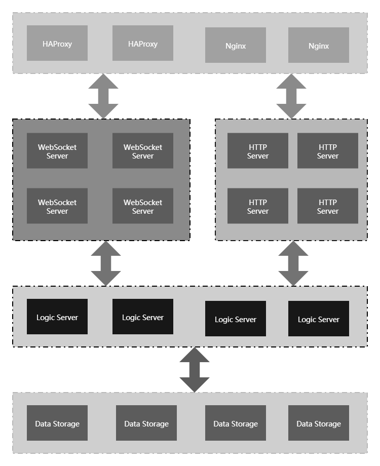
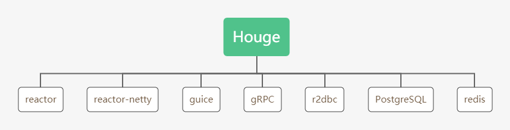
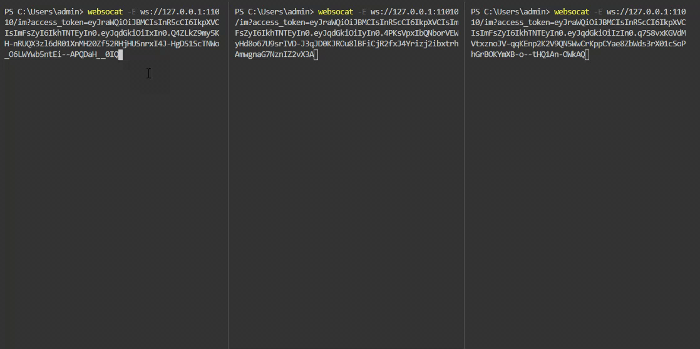

# Houge

[We Are Reactive](https://www.reactivemanifesto.org/zh-CN)

Houge 是一款开源免费的**实时消息推送服务**，采用 [Spring Reactor](https://projectreactor.io/) 作为基础技术研发，完全采用反应式（Reactive Programming）编程模式实现。

服务端采用模块化设计，内置简洁通讯协议，扩展性强，可配置化，部署简单，集群等特点。

架构将连接服务与逻辑服务分离，可动态扩展集群节点。单台WS服务支持同时保持**百万链接**，天生拥有高吞吐量特性。

## 架构

## 技术栈

## 交互流程图

## 功能

- [x] 用户认证
- [x] 私人聊天
- [x] 群组聊天
- [x] 消息存储
- [x] 容器部署
- [x] 好友关系
- [x] 离线消息
- [x] 集群部署
- [ ] 系统监控
- [ ] 黑名单

## 文档

- [开发手册](docs/dev/index.md)
- [使用手册](docs/manual/index.md)
- [消息协议](docs/design/message_protocol.md)
- [安装部署](docs/deployment/install.md)
- [分布式消息 ID 设计](docs/design/message_id.md)
- [REST 接口文档](https://kk70.gitee.io/houge/houge-rest.html)

## 演示

### 私人消息

### 群组聊天

### HTTP 发送消息

### gRPC 发送消息

## 感谢

Houge 的实现离不开源社区的支持，感恩为开源做出贡献的人。

## 捐赠

如果您觉得 Houge 做得不错，对您有实际的帮助，请支持我们更好的维护项目。

