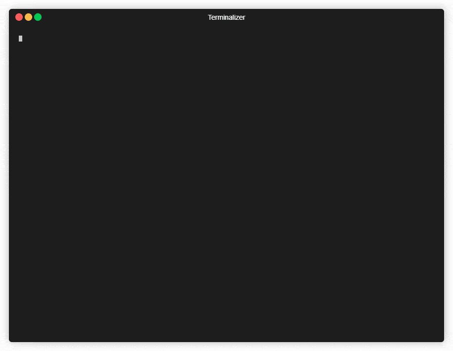

# Tethys
[We Are Reactive](https://www.reactivemanifesto.org/zh-CN)

Tethys 是采用 [Spring Reactor](https://projectreactor.io/) 开发的 IM Server，致力于服务端响应式技术开发推广与研究，可快速搭建功能完备、高性能且可定制化的 IM 服务。

## 特点
- 免费的
- 高性能
- 可靠的

## 功能
- [x] 用户认证
- [x] 私人聊天
- [x] 群组聊天
- [x] 消息存储
- [x] 容器部署
- [ ] 好友关系
- [ ] 离线消息
- [ ] 集群部署
- [ ] 系统监控
- [ ] 黑名单

## 开发准备
- Java 11
- IntelliJ IDEA
    - [Lombok](https://plugins.jetbrains.com/plugin/6317-lombok)
    - [Google Java Format](https://plugins.jetbrains.com/plugin/8527-google-java-format)
    - [SonarLint](https://www.sonarlint.org/intellij)
- Redis
- [websocat](https://github.com/vi/websocat) WebSocket 命令行测试工具

### Google Java Format 配置
1. 去到 `File → Settings → Editor → Code Style`
2. 单击带有工具提示的扳手图标显示计划动作
3. 点击 `Import Scheme`
4. 选择项目根目录下 `config/intellij-java-google-style.xml` 文件
5. 确保选择 GoogleStyle 作为当前方案

## 文档
- [使用手册](docs/manual/index.md)
- [用户认证](docs/design/authentication.md)
- [消息协议](docs/design/message_protocol.md)
- [安装部署](docs/deployment/install.md)
- [分布式消息 ID 设计](docs/design/message_id.md)
- [REST OpenAPI 接口文档](https://kk70.gitee.io/tethys/tethys-rest-oais/tethys-rest.html)

## Browser WebSocket Client
使用 Chrome 浏览器安装扩展 [Browser-WebSocket-Client
](https://github.com/abeade/browser-websocket-client) 用于快速测试 WebSocket。

## 演示

<iframe src="//player.bilibili.com/player.html?aid=502122156&bvid=BV1CN411Q7dX&cid=307515662&page=1" scrolling="no" border="0" frameborder="no" framespacing="0" allowfullscreen="true"></iframe>

## 私聊演示

## 群聊演示

## 感谢
Tethys 的实现离不开源社区的支持，感恩为开源做出贡献的人。

## 捐赠
如果您觉得 Tethys 做得不错，对您有实际的帮助，请支持我们更好的维护项目。

