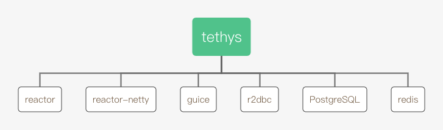
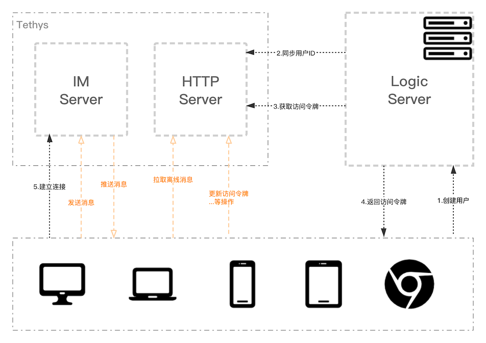
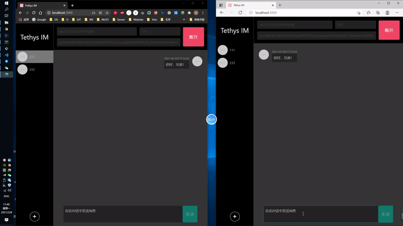

# Tethys

[We Are Reactive](https://www.reactivemanifesto.org/zh-CN)

一个 IM 服务端项目，采用 [Spring Reactor](https://projectreactor.io/) 作为基础技术研发，全站响应式技术应用(Reactor/R2DBC/Netty)。

内置完整的 IM 通讯协议，使用 WebSocket + HTTP 方式实现整个 IM 系统相关业务。

**能够完全独立于业务系统之外运行，且能够方便快速的与现有系统整合，并提供了 HTTP、gRPC 服务接口能方便的与 Tethys 进行通讯，你可用于它快速搭建搭建私域 IM 服务，或用于替代公有云 IM 服务。**

## 特点

- 响应式
- 免费的
- 高性能

## 技术栈

## 交互流程图

## 功能

- [x] 用户认证
- [x] 私人聊天
- [x] 群组聊天
- [x] 消息存储
- [x] 容器部署
- [x] 好友关系
- [x] 离线消息
- [ ] 集群部署
- [ ] 系统监控
- [ ] 黑名单

## 文档

- [开发手册](docs/dev/index.md)
- [使用手册](docs/manual/index.md)
- [用户认证](docs/design/authentication.md)
- [消息协议](docs/design/message_protocol.md)
- [安装部署](docs/deployment/install.md)
- [分布式消息 ID 设计](docs/design/message_id.md)
- [REST OpenAPI 接口文档](https://kk70.gitee.io/tethys/tethys-rest-oais/tethys-rest.html)

## 演示

[Tethys IM 演示视频1](https://www.bilibili.com/video/BV1CN411Q7dX)

## 私聊演示

## 群聊演示

## 感谢

Tethys 的实现离不开源社区的支持，感恩为开源做出贡献的人。

## 捐赠

如果您觉得 Tethys 做得不错，对您有实际的帮助，请支持我们更好的维护项目。

